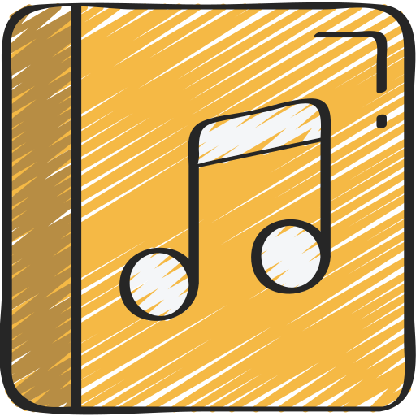

  
  
  [Icon by juicy_fish](https://www.flaticon.com/authors/juicy-fish)
   
  [Documentation](https://execaman.github.io/discolink) | [Coverage](http://app.codecov.io/gh/execaman/discolink)

## 🎵 Introduction

The goal of this library is to abstract away obvious steps involved in the process of acting as an intermediary between a [Discord bot](https://discord.com/developers/docs/events/gateway) and [Lavalink](https://lavalink.dev/api) to provide a simple and intuitive interface to work with.

## 🛠️ Requirements

Built for [Node.js](https://nodejs.org) v22+ — [Bun](https://bun.com) v1+ and [Deno](https://deno.com) v2+ may also work. Pairs with any [Discord gateway client](https://docs.discord.com/developers/events/gateway) capable of sending and receiving raw payloads — no lock-in to a specific library.

## ⚖️ Standards & License

Released under the [Apache 2.0](./LICENSE) license. Versioning follows [SemVer](https://semver.org/), so breaking changes only land in major releases. Development is driven by an [Agile SDLC](https://www.geeksforgeeks.org/software-engineering/agile-sdlc-software-development-life-cycle/), meaning the library evolves incrementally with a focus on stability and predictable releases.
