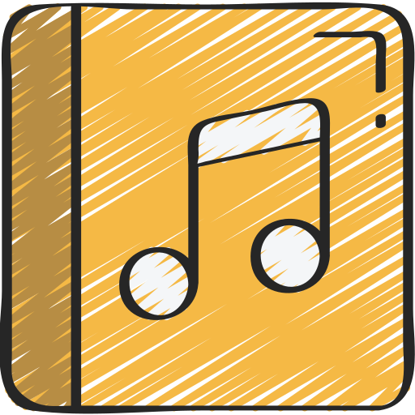

<div align="center">
  
  
  [Icon designed by juicy_fish](https://www.flaticon.com/authors/juicy-fish)
  <br/>
  [Documentation](https://github.com/execaman/discolink/wiki) | [API Reference](https://execaman.github.io/discolink)
</div>

> [!NOTE]
> I currently do not have the time to write docs or update wiki, please use typescript or go through the api reference.

## 🎯 Purpose

The goal of this library is to abstract away obvious steps involved in the process of acting as an intermediary between [Lavalink](https://lavalink.dev/api) and [Discord](https://discord.com/developers/docs/events/gateway) to give developers a cleaner yet intuitive interface to work with.

## ⚙️ Requirements

- **Runtime** - one of the following:
  - [Node.js](https://nodejs.org) v22+
  - [Bun](https://bun.com) v1+
  - [Deno](https://deno.com) v1.4+ (unstable)
- **Library** - any gateway client that supports:
  - sending raw payloads over the connection
  - receiving raw payloads from the connection
- **Lavalink** - at least with the following configuration:
  - disabled local tracks - for unique track identifiers
  - disabled built-in youtube source utilising their [plugin](https://github.com/lavalink-devs/youtube-source#plugin) instead (optional)

## 🕓 Configuration

Any gateway client library meeting the requirements above is supported, you can apply the following pseudocode (this is the basic approach):

```js
import { Client } from "main-lib";
import { Player } from "discolink";

const client = new Client(...);

client.player = new Player({
  nodes: [], // add your nodes
  async forwardVoiceUpdate(guildId, payload) {
    // send the given payload to your gateway connection
    client.guilds.cache.get(guildId).shard.send(payload);
  }
});

client.on("raw", (payload) => {
  // call the handler on gateway dispatch
  client.player.voices.handleDispatch(payload);
});

client.login();
```
